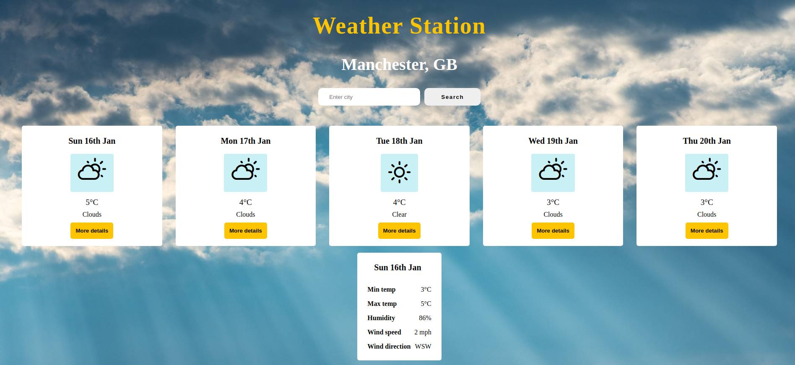
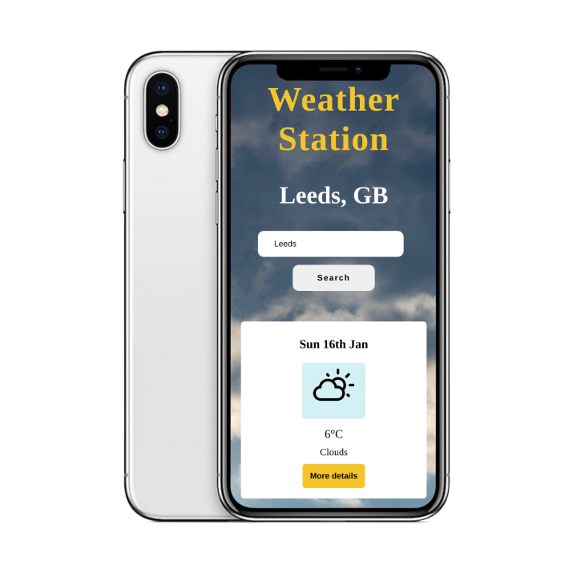

# ⚡ Weather Station ⚡

A 5-day weather forecast app built using [Create React App](https://github.com/facebook/create-react-app). It uses a third party API to retrieve forecast data for UK cities, including temperature, humidity, wind speed and direction, and a general weather description. 

## About the project
The app uses React components and hooks and is styled using responsive CSS for desktop and mobile. 

The app was tested during development using React Testing Library and deployed using Heroku. 

Check out a deployed version of the app [here](https://ac-weather-app.herokuapp.com/)

## Tech 
* React
* React Testing Library
* Third-party API (Manchester Codes)

To open the project in development mode, run the following command from the project root:

`npm start`

## Screenshots

